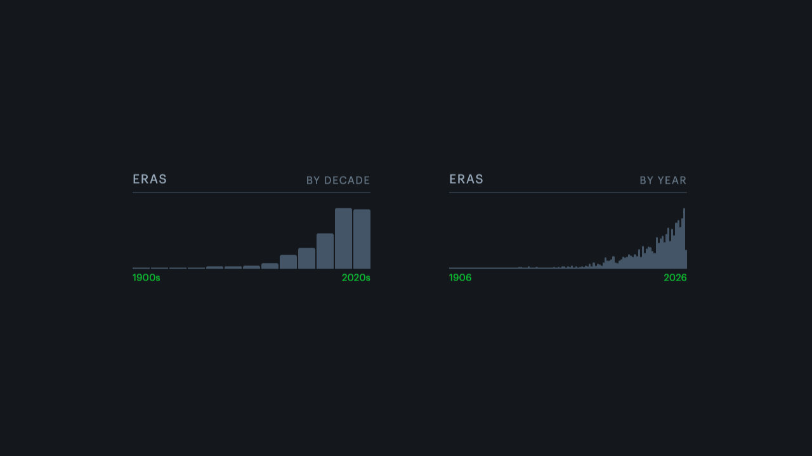
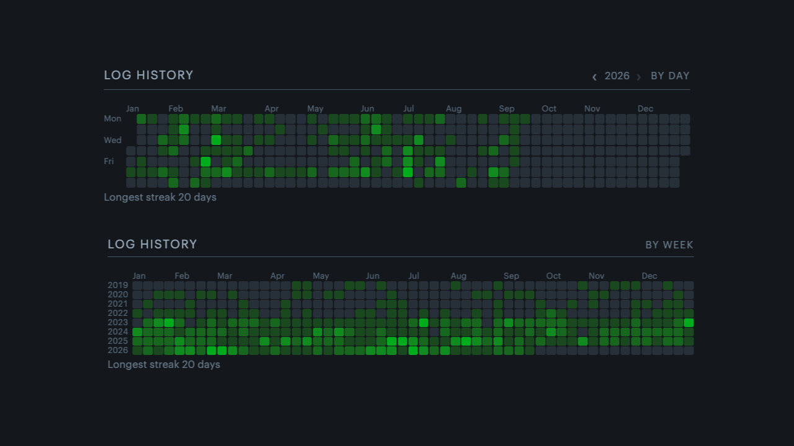
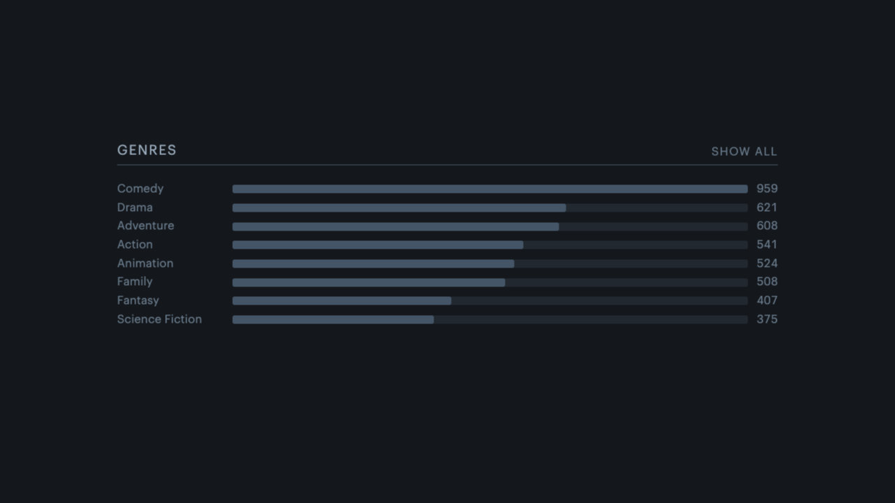
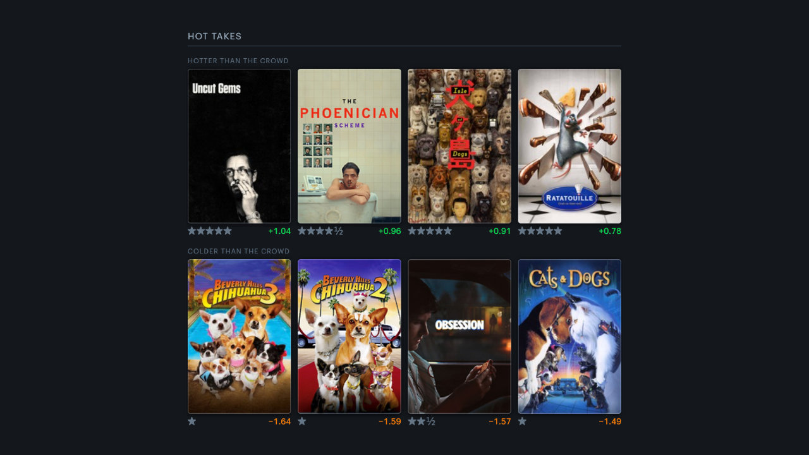
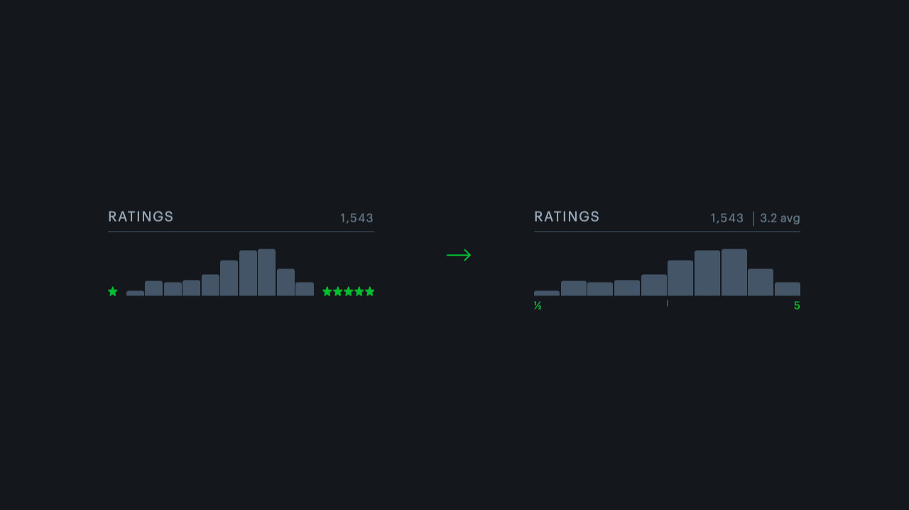

# Letterboxd Profile Extras

Chromium extension that adds extra analytics panels to any Letterboxd member's profile page. With the aim to adhere to Letterbox's visual language with existing css and components.

## Install

1. Go to `chrome://extensions`
2. Turn on Developer mode
3. Load unpacked → pick this folder
4. Open any Letterboxd profile

## Features

### Eras



A histogram of the release years of every film the member has watched. Defaults to decade buckets, the header link names the view you're currently in and switches to the other one. Bars link through to the matching Letterboxd filter.

### Log History



Diary entries over time, in four views: by day, by week, by month and by year. Longest streak is all-time, not scoped to whatever is on screen.

### Genres



Most-watched genres as ranked horizontal bars. Top 8 with a "Show all" toggle, rows link through to the genre filter. Films carry several genres each, so these counts deliberately sum to more than the number of films watched, and each bar's tooltip gives it as a share of films watched.

### Hot Takes



The films the member rates furthest from the crowd. Two poster rows matching Favorite Films and Recent Activity, four each: hotter above, colder below, with the member's stars and the deviation from the community average under each poster. Hovering a poster gives their rating, the community average and how many ratings it rests on.

### Ratings Rework



Edits Letterboxd's existing sidebar histogram, dropping the flanking ★ glyphs so the plot spans the full width, replacing it with a ½ … 5 scale underneath with a midpoint tick. Also shows the mean rating of all logged movies beside the rated count.

## How the Data is Collected

Ratings costs nothing. Every bar of the native histogram already carries its exact count in the tooltip text the page shipped with, so the mean is a DOM read with no crawl and no wait.

The other panels do have to scrape. There's no longer a public API, so they read the member's own paginated list pages with same-origin `fetch` and parse them with `DOMParser`:

- The films index (`core/films.js`), used by both Eras and Hot Takes: `/{user}/films/by/rating/`, 72 per page. Each tile gives the title, slug, release year (from `data-item-name`, `"Look Back (2026)"`, falling back to the slug) and the member's own rating, rendered as stars. Walking the _community rating_ sort rather than the default costs nothing extra and hands Hot Takes an exact community-average rank for free. One crawl serves both panels.

- Diary dates: `/{user}/diary/` then `/{user}/diary/films/page/N/`, 50 per page. The date comes off `a.daydate`'s href (`/{user}/diary/films/for/2026/09/07/`), so rewatches count separately.

Page count is read from the paginator, then the remaining pages go through the same `pooled()` helper and the same shared limiter as everything else. Results are aggregated to counts (`{year: n}` and `{"YYYY-MM-DD": n}`) before being cached in `chrome.storage.local` for 6 hours, so only the first view of a profile pays the crawl cost.

Genre isn't in the films grid, so it can't come out of the Eras crawl, and there's no count anywhere in the filter UI. But a filtered list can be counted without walking it: page 1 gives both the page size and the page count, so only the last page has to be fetched for the remainder. A genre therefore costs one request when it fits on a page and two when it doesn't, instead of one per page of results. The 19 genre slugs are read off the member's own films page rather than hardcoded, so a new genre on Letterboxd's side turns up on its own.

Hot Takes needs the community average, which isn't on any list page. It doesn't need the 330 KB film page either. Letterboxd renders the rating histogram as a standalone component:

```
/csi/film/parasite-2019/rating-histogram/
-> 5.7 KB, "Weighted average of 4.52 based on 5,826,510 ratings"
```

About 56x smaller than the film page, so a few dozen are cheap. Still one request per film, which is what the crawl order buys back. `/{user}/films/by/rating/` is sorted by exactly that weighted average - checked against 65 measured averages with zero inversions across all 2,080 pairs - so a film's position in the index _is_ its exact community rank, without knowing the value. Under 200 rated films every one is measured, which is exact. Above that, rank is scored against the member's own rating to shortlist the 25 likeliest extremes per side, and only those are measured: about 50 requests instead of one per film. That shortlist is a heuristic and can miss a borderline entry on a very large account, so the panel says how many of the rated films it actually measured.

Averages resting on fewer than 1,000 community ratings are dropped, because a handful of ratings makes an average that is mostly noise and would otherwise dominate the extremes.

### Rate limiting

Every request in the extension goes through one shared limiter in `core/net.js`, capped at four in flight. Panels mount and crawl independently, so without it the ceiling would be `CONCURRENCY` per panel and three crawling panels would put nine requests on the wire at once, comfortably past the point where Cloudflare starts refusing them. Backoff sleeps happen outside the limiter so a retrying request isn't sitting on a slot another panel could use.

Letterboxd sits behind Cloudflare and will sporadically refuse a request in the middle of an otherwise healthy crawl. Measured at roughly 1 page in 20 at this request rate, either as a 403 challenge or a 429. Cloudflare also serves its interstitial with a 200, so `net.js` sniffs the body as well as the status. Every request retries with exponential backoff and jitter; any page that still fails is counted and surfaced as a "Partial data" line under the chart rather than being silently dropped, which is what previously turned throttling into quietly wrong numbers. A crawl that came back incomplete is also not written to the cache (`shouldCache` in `core/cache.js`), so a page reload retries it instead of serving short counts for the next six hours.

## Known limits

- A 3,000-film account is roughly 48 + 66 page requests on a cold load. It works, but it takes a few seconds and it is a lot of requests. `PAGE_CAP` in `src/core/net.js` caps it at 200 pages per list.
- Only fires on the profile home page (`/{user}/`). Detection is `body[data-owner]`, a path match, and the absence of `screen-member-child-page`.
- Mounts once on page load. Letterboxd is server-rendered so that's nearly always fine, but a client-side navigation between profiles wouldn't re-mount.
- Insertion point for Log History is "right after Recent activity". On profiles that also have Recent reviews / Popular reviews / Tags, those still sit between it and Following.
- Selectors are pinned to Letterboxd's current markup (Sept 2026). They're confined to the `extract*` functions, `core/bar-chart.js`, and each panel's `anchor`.
